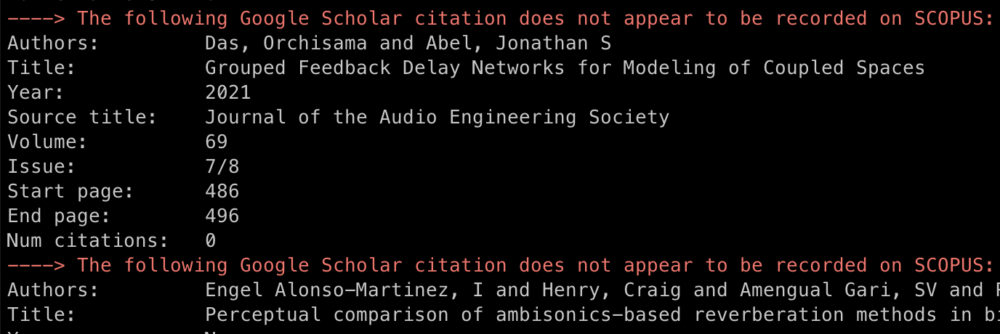

# Scopus Checker
A python script to check which Google Scholar documents and citations are missing from Scopus.



## About The Project

If you ever had to cross-check which papers and citations Scopus forgot to index, you would know--it is not fun. This script may provide a little help with that. 

**Please notice that this is a rather unreliable tool, and should only be used as a rough first screening. I take no responsibility for any missed citations or documents. See `LICENSE` for more information.**


## Getting Started

To get a local copy up and running follow these steps.

### Prerequisites

You are going to need:
- `pip` [https://pip.pypa.io/en/stable/installation/](https://pip.pypa.io/en/stable/installation/)
- `virtualenv` [https://virtualenv.pypa.io/en/latest/installation.html](https://virtualenv.pypa.io/en/latest/installation.html)
- a Scopus subscription (your University will probably provide that?) 

### Installation

1. Clone the repo and go into the directory
   ```sh
   git clone git@github.com:enzodesena/scopus-checker.git
   cd scopus-checker
   ```
2. Create python environment and activate it
   ```sh
   virtualenv -p /usr/bin/python3 env
   source env/bin/activate
   ```
3. Install pip packages
   ```sh
   pip install -r requirements.txt
   ```
4. (Optional, but not so optional) Get a free API Scraper Key at [scraperapi.com](https://www.scraperapi.com) and copy/paste your scraper API key. 


<!-- USAGE EXAMPLES -->
## Usage

Before you can use the tool, you need to download some information from Scopus:

1. Go to [scopus.com](https://www.scopus.com) and look up your own profile. The free search would not be enough for that. 
2. Go to `Documents` -> `Export all`, select `CSV`, and toggle all options under `Citation information` and nothing else; click on `Export` and move the file to your repository directory; we will call this the 'document file'.
3. Go to `Cited by XXX Documents` -> `Export all`, select `CSV`, and toggle all options under `Citation information` and also **Include references**; click on `Export` and move the file to your repository directory; we will call this the 'citations file'.

Now you are ready to run the script. Go into your repository directory and run the python script (if you haven't done so already, activate the virtual environmnet with `source env/bin/activate`):
   ```sh
   cd scopus-checker
   python scopus-checker.py -d <document file> -c <citations file> -a '<your name and surname>' -p scraperapi -k <your own scraper api key>
   ```

In this final step, notice how we used the `scraperapi` proxy option. Given how strict Google Scholar has become over the years, this is pretty much the only option that will make this script work. You can also run the script without proxies, but it is unlikely to work for very long (see [scholarly proxies](https://scholarly.readthedocs.io/en/stable/quickstart.html#using-proxies) for more information).


<!-- CONTRIBUTING -->
## Contributing

Contributions are what make the open source community such an amazing place to learn, inspire, and create. Any contributions you make are **greatly appreciated**.

If you have a suggestion that would make this better, please fork the repo and create a pull request. You can also simply open an issue with the tag "enhancement".
Don't forget to give the project a star! Thanks again!

1. Fork the Project
2. Create your Feature Branch (`git checkout -b feature/AmazingFeature`)
3. Commit your Changes (`git commit -m 'Add some AmazingFeature'`)
4. Push to the Branch (`git push origin feature/AmazingFeature`)
5. Open a Pull Request


<!-- LICENSE -->
## License

Distributed under the MIT License. See `LICENSE` for more information.


<!-- CONTACT -->
## Contact

Enzo De Sena:
[desena.org](https://desena.org) 
[@enzoresearch](https://twitter.com/EnzoResearch) 


<!-- ACKNOWLEDGMENTS -->
## Acknowledgments


This script uses [scholarly](https://github.com/scholarly-python-package/scholarly).
